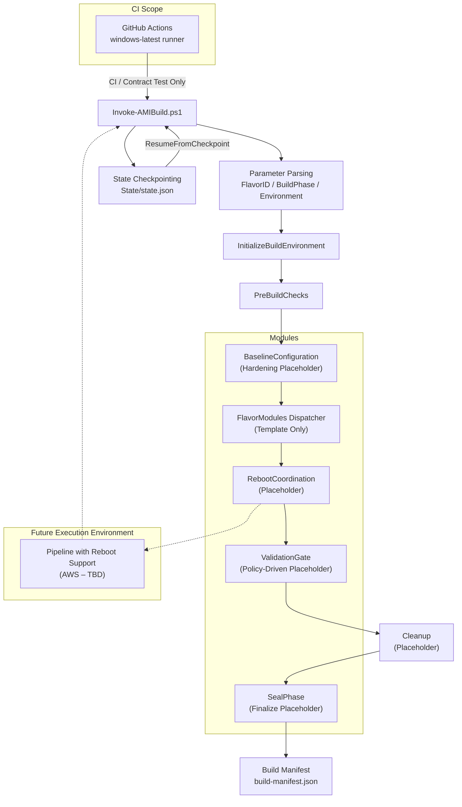

# Golden AMI Orchestrator (Skeleton Framework)

## Overview

This repository contains the **Golden AMI Orchestrator skeleton** for the **Equifax AWACS / Vine migration program**.

It provides a **stable, extensible, and pipeline-agnostic orchestration framework** for Golden AMI builds while intentionally deferring environment- and vendor-specific behavior until validated inputs are provided.

This repository implements **structure and contracts only** — not final AMI logic.

---

## Design Principles

* Parameter-driven execution
* No AWS-, Equifax-, or vendor-specific assumptions
* No hardcoded secrets or endpoints
* Idempotent where feasible
* Additive future changes (no rewrites)

---

## What Is Implemented

* Single orchestration entry point (`Invoke-AMIBuild.ps1`)
* Deterministic execution flow (placeholder steps)
* Structured logging and build manifest
* Resume checkpointing (skeleton)
* SentinelOne handling hooks (placeholders)
* Contract test mode for CI validation

---

## Execution Flow (Skeleton)

1. InitializeBuildEnvironment
2. PreBuildChecks
3. BaselineConfiguration
4. FlavorModules
5. RebootCoordination
6. ValidationGate
7. Cleanup
8. SealPhase

---

## Architecture Diagram

> *The diagram below illustrates the orchestration flow, module boundaries, and CI scope.*

## Architecture Diagram

---

## GitHub Actions Usage

GitHub Actions is used **only for contract validation** (`-TestContract`).

* Validates parameters, module loading, and logging
* Emits and stores the build manifest
* Does **not** perform AMI builds or handle reboots

Reboot-capable execution will be finalized once AWS ProServe confirms supported pipeline behavior.

---

## Status

*  Skeleton framework complete
*  Architecture-review ready
*  Pipeline-agnostic

**No further work is required at this phase.**
